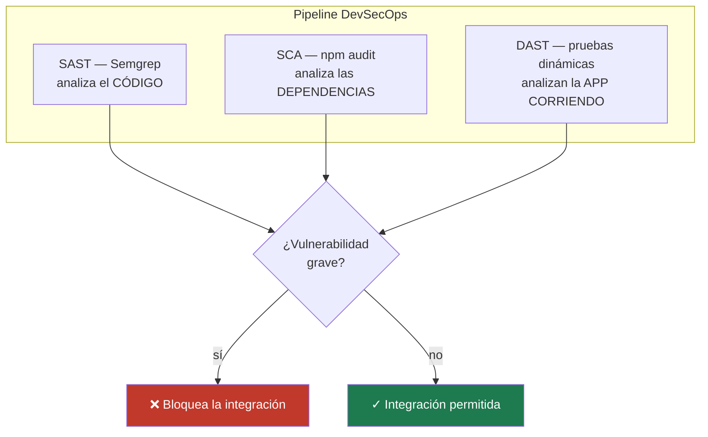

# DevSecOps — Seguridad Automatizada en el Pipeline

Pipeline de **seguridad shift-left** que integra tres capas de análisis automático como *quality gates*: **SAST** (análisis estático del código), **SCA** (vulnerabilidades en dependencias) y **DAST** (pruebas dinámicas sobre la aplicación corriendo).


---

## Resumen ejecutivo

| | |
|---|---|
| **Qué es** | La automatización de controles de seguridad dentro del pipeline de CI, de modo que cada cambio se analiza en busca de vulnerabilidades antes de integrarse. |
| **Problema que resuelve** | La seguridad tratada como una auditoría anual llega tarde y cara. Este enfoque detecta código inseguro, dependencias vulnerables y debilidades en tiempo de ejecución en cada cambio. |
| **Enfoque** | Tres capas complementarias (SAST + SCA + DAST) con gates por severidad: una vulnerabilidad grave bloquea la integración. |
| **Resultado** | Detección automática y temprana de las clases de vulnerabilidad más comunes (OWASP Top 10), con la aplicación endurecida pasando todos los gates y ejemplos que demuestran la detección. |
| **Stack** | Semgrep · npm audit · Vitest (DAST propio) · OWASP ZAP (referencia) · GitHub Actions |

---

## Las tres capas de seguridad



| Capa | Qué analiza | Herramienta | Detecta, por ejemplo |
|---|---|---|---|
| **SAST** | El código fuente (estático) | Semgrep | Command/SQL injection, `eval`, secretos hardcodeados |
| **SCA** | El árbol de dependencias | npm audit | CVEs conocidos en librerías |
| **DAST** | La app en ejecución (dinámico) | Pruebas propias + OWASP ZAP | XSS reflejado, headers faltantes, control de acceso |

---

## Aplicación endurecida + ejemplos vulnerables

El repositorio contiene dos cosas distintas, a propósito:

- **`src/`** — una aplicación **segura**: headers de seguridad, escape de HTML (anti-XSS), login sin filtración de información y con comparación en tiempo constante, control de acceso al recurso protegido. Pasa todos los gates.
- **`security/examples-insecure/`** — snippets **vulnerables a propósito**, que **no** son parte de la app. Existen para demostrar que el SAST los detecta:

```
$ semgrep --config security/semgrep-rules.yml security/examples-insecure/
❯❯❱ node-command-injection      exec() con entrada dinámica
❯❯❱ sql-injection-string-concat query por interpolación de string
❯❯❱ use-of-eval                 eval() de código arbitrario
❯❯❱ hardcoded-secret            secreto hardcodeado
4 Code Findings
```

---

## Los gates funcionan (verificado en ambos sentidos)

- **SAST:** limpio sobre `src/` (gate pasa) y con 4 hallazgos sobre los ejemplos (detección demostrada).
- **DAST:** 8 pruebas dinámicas de seguridad en verde contra la app.
- **SCA:** durante el desarrollo, el gate **detectó una vulnerabilidad real** (el advisory de esbuild en una dependencia de test) y bloqueó — se remedió actualizando la dependencia. Es exactamente para lo que sirve el gate.

---

## Estructura

```
src/
├── server.ts                 # aplicación segura bajo prueba
└── main.ts                   # arranque de la app
tests/security.test.ts        # DAST propio (pruebas dinámicas de seguridad)
security/
├── semgrep-rules.yml         # reglas SAST (locales, deterministas)
└── examples-insecure/        # anti-patrones para demostrar la detección
scripts/sca-gate.mjs          # gate SCA (falla en high/critical)
.github/workflows/
├── devsecops.yml             # SAST + SCA + DAST (gates)
└── zap-dast.yml              # OWASP ZAP baseline (referencia, manual)
```

---

## Uso

```bash
npm install

npm test                       # DAST propio (pruebas dinámicas de seguridad)
npm run sca                    # gate SCA (npm audit → falla en high/critical)
npm run typecheck

# SAST (requiere semgrep instalado, o vía Docker):
semgrep --config security/semgrep-rules.yml src/ --error              # gate: limpio
semgrep --config security/semgrep-rules.yml security/examples-insecure # detección
```

---

## Documentación técnica

**[docs/DOCUMENTACION-TECNICA.md](docs/DOCUMENTACION-TECNICA.md)** detalla: qué es DevSecOps y shift-left, las tres capas en profundidad, las decisiones de gating por severidad, el endurecimiento de la aplicación (OWASP Top 10), el rol de OWASP ZAP y las vías de extensión.

---

## La suite completa

Este repositorio forma parte de una suite de automatización de calidad que cubre el ciclo de testing de punta a punta, de los fundamentos a las prácticas propias de un rol SDET.

**Fundamentos**

1. [Framework E2E de UI](https://github.com/fercarballo/playwright-e2e-framework-saucedemo) — Playwright · Page Object Model
2. [Testing de API](https://github.com/fercarballo/api-testing-framework-restful-booker) — contract testing con Zod
3. [Pipeline CI/CD](https://github.com/fercarballo/qa-automation-cicd-pipeline) — GitHub Actions · quality gates
4. [Estabilidad y flakiness](https://github.com/fercarballo/flakiness-hunting-playwright) — detección y erradicación
5. [Regresión visual & contract testing](https://github.com/fercarballo/visual-and-contract-testing) — Playwright + Pact

**Avanzado (SDET)**

6. [Performance & load testing](https://github.com/fercarballo/performance-testing-k6) — k6 · thresholds como gate
7. [Integración con dependencias reales](https://github.com/fercarballo/integration-testing-testcontainers) — Testcontainers · Postgres
8. **DevSecOps** — este repositorio
9. [Tooling interno de QA](https://github.com/fercarballo/qa-insights) — test impact + flaky detection
10. [Evals de aplicaciones con IA](https://github.com/fercarballo/llm-evals-harness) — LLM testing

---

## Licencia

MIT.
